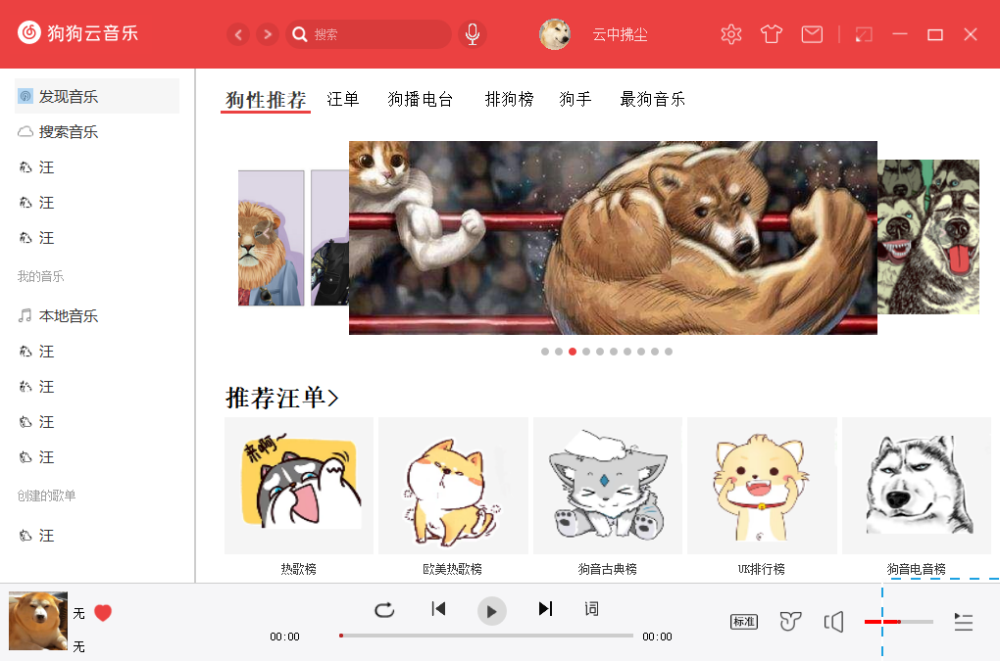
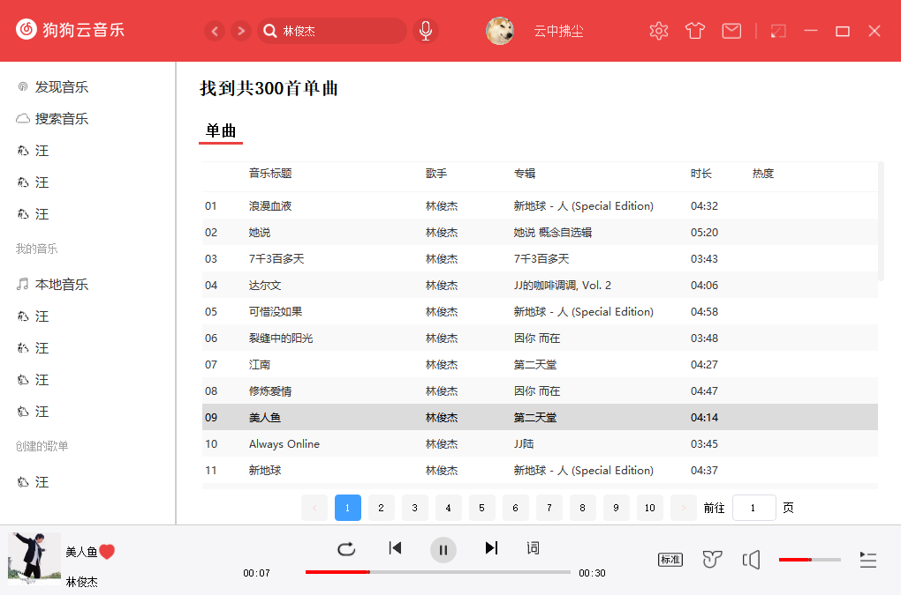
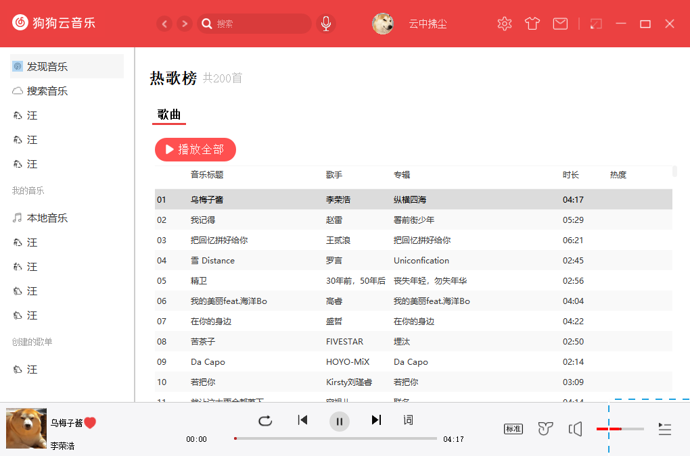
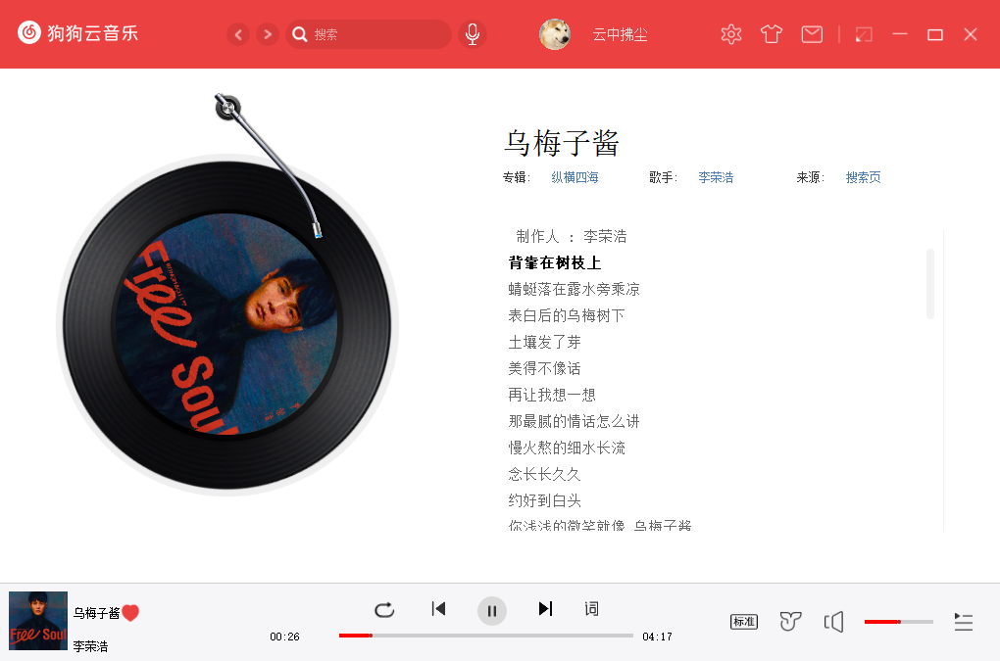

# 狗狗云音乐

## 简介

基于Qt以及网易云音乐API的在线音乐软件

## 运行界面

## 安装方法

1.git clone git@github.com:yunzhongfuchen/DogMusic.git

2.使用vs打开，根据情况进行设置

3.编译运行

## 说明

软件基于网易云API，程序已将网易云API进行打包，运行时自动启动，充当本地服务器，无需再起服务器

## 参考

1.网易云API https://binaryify.github.io/NeteaseCloudMusicApi/#/

2.开源播放器 https://blog.csdn.net/gy827257174/article/details/126650588
